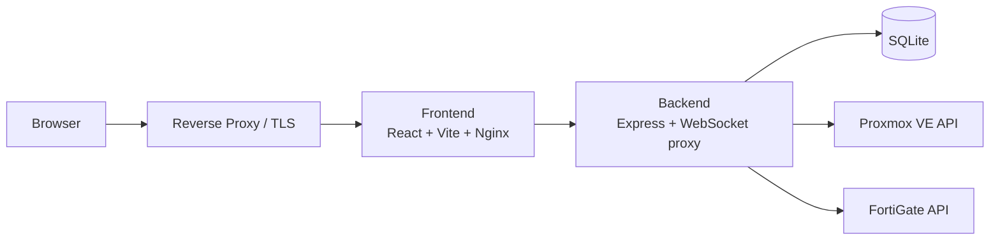

# Homelabrrr

> Self-service homelab portal for Proxmox and FortiGate

[](#stack)
[](#stack)
[](#stack)
[](#quick-start)
[](#security-model)

Homelabrrr is a web portal for running a self-service Proxmox environment with FortiGate-backed networking.
Users get VM access, browser console access, SSH, provisioning, and account management.
Admins get a single interface for hosts, firewalls, VLANs, policies, assignments, users, and audit history.

It is built for homelab deployment behind a reverse proxy such as Nginx Proxy Manager.
The frontend serves internal HTTP, and TLS is expected to terminate at the proxy layer.

## Why This Exists

Most homelabs end up split across several tools:

- Proxmox for compute
- FortiGate for networking
- spreadsheets or notes for assignments
- ad-hoc access management

This project pulls those into one interface so users can work inside guardrails instead of getting raw platform access.

## Highlights

| Area | What you get |
| --- | --- |
| VM access | Assigned VM listing, browser VNC, VM detail views |
| SSH | Browser-based SSH terminal using uploaded keys |
| Provisioning | Template-driven VM creation for approved users |
| Networking | VLAN management, VLAN-to-user assignment, FortiGate policy builder |
| Admin delegation | Granular permission flags instead of only admin vs user |
| Security | Session auth, TOTP 2FA, audit logging, per-VM SSH authorization |

## UI Overview

### User side

- `My VMs` for assigned VM inventory and quick actions
- `New VM` for template-based provisioning
- `SSH Keys` for uploaded keys used by the browser terminal
- `Account` for password and 2FA management

### Admin side

- `PVE Hosts` for Proxmox host registration
- `Firewalls` for FortiGate registration and managed-switch aware VLAN provisioning
- `VLANs` for network definitions
- `Policies` for the visual traffic mesh and service-based policy creation
- `Assignments` for VM and VLAN mapping
- `Users` for accounts, permissions, and enforced 2FA
- `Audit Log` for change tracking
- `Changelog` viewer in the admin sidebar

## Architecture



## Stack

- Frontend: React 18, Vite, Tailwind CSS
- Backend: Node.js, Express, `ws`, `ssh2`
- Database: SQLite via `better-sqlite3`
- Auth: session cookies + TOTP 2FA
- Console access: Proxmox VNC websocket proxy
- SSH terminal: `xterm.js` in the browser, server-side SSH proxy
- Deployment: Docker Compose

## Screens and Flow

The current UI is built around a left navigation shell with focused task pages:

- VM dashboard for daily user operations
- modal-based VNC and SSH access
- admin pages split into Infrastructure, Networking, and Access sections
- a visual policy mesh for understanding VLAN relationships

If you want this README to include actual screenshots, add image files under something like `docs/` and link them here.

## Quick Start

### 1. Create your environment file

```bash
cp .env.example .env
```

Then set at least:

- `SESSION_SECRET` to a long random value
- `ALLOWED_ORIGIN` to your public portal URL
- `COOKIE_SECURE=true` when the site is served behind HTTPS

If the database is brand new and empty, also set:

- `INITIAL_ADMIN_USERNAME`
- `INITIAL_ADMIN_PASSWORD`

Those bootstrap values are only used to create the first admin account on first run.

### 2. Build and start

```bash
docker compose up -d --build
```

### 3. Put it behind a reverse proxy

Recommended model:

- TLS terminates at Nginx Proxy Manager or another reverse proxy
- the proxy forwards traffic to the frontend container
- the frontend talks to the backend over the internal Docker network

By default, the frontend is published on port `8181`.
Use `FRONTEND_BIND_ADDRESS=127.0.0.1` if the proxy runs on the same host and you do not want the UI exposed directly.

## Environment

Example values live in [`.env.example`](/root/Proxmox-frontend/.env.example).

| Variable | Purpose |
| --- | --- |
| `SESSION_SECRET` | Session signing secret |
| `ALLOWED_ORIGIN` | Allowed browser origin for CORS |
| `COOKIE_SECURE` | Marks auth cookies as secure |
| `TRUST_PROXY` | Number or mode used for Express proxy trust |
| `INITIAL_ADMIN_USERNAME` | First admin username for empty DB bootstrap |
| `INITIAL_ADMIN_PASSWORD` | First admin password for empty DB bootstrap |
| `FRONTEND_BIND_ADDRESS` | Host bind address for frontend publishing |

## Security Model

Current hardening in the codebase includes:

- no hardcoded default admin user on fresh install
- optional mandatory 2FA enrollment
- assignment-aware VM access
- per-VM SSH authorization and stored destination config
- per-host Proxmox TLS verification settings
- granular admin permissions for delegation
- audit logging for admin actions

Operationally important:

- The frontend is plain HTTP inside Docker by design.
  Put TLS at the reverse proxy.
- The SQLite volume contains sensitive operational data.
  Back it up and protect it.
- SSH private keys are stored in the application database for browser terminal access.
  Treat the DB as sensitive.

## Reverse Proxy Notes

This project is intended to run like this:

1. Internet traffic hits your reverse proxy
2. The reverse proxy handles HTTPS
3. The proxy forwards requests to the frontend container
4. The frontend proxies API and websocket traffic to the backend

That matches a homelab setup where the app itself stays internal and the public edge is handled elsewhere.

## Repo Layout

```text
backend/              Express API, websocket proxies, DB schema, integrations
frontend/             React SPA, admin pages, policy mesh UI, nginx config
CHANGELOG.md          Release notes, also shown inside the admin UI
docker-compose.yml    Main deployment entrypoint
.env.example          Safe environment template
```

## Versioning and Rollback

Git gives you code history and rollback.
It does not roll back:

- the SQLite database volume
- saved credentials inside the DB
- firewall changes already pushed to FortiGate
- Proxmox-side changes already applied

If you want safe rollback in practice, pair Git with database backups and network config backups.

## Changelog

Recent changes are tracked in [`CHANGELOG.md`](/root/Proxmox-frontend/CHANGELOG.md).
Admins can also open the changelog directly from the sidebar in the UI.
