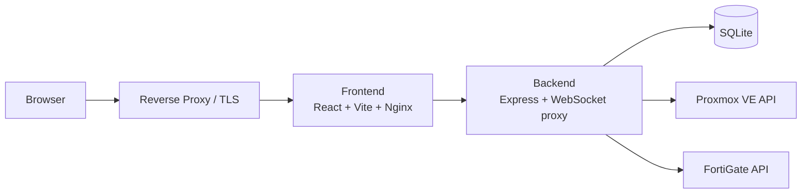

# Homelabrrr

> Self-service homelab portal for Proxmox and FortiGate

[](#stack)
[](#stack)
[](#stack)
[](#quick-start)
[](#security-model)

Homelabrrr is a web portal for running a self-service Proxmox environment with FortiGate-backed networking.
Users get assigned VM/LXC access, browser VNC, browser SSH, SFTP file access, provisioning, and account management.
Admins get a single interface for Proxmox hosts, FortiGate firewalls, VLANs, policies, port forwards, assignments, users, and audit history.

It is built for homelab deployment behind a reverse proxy such as Nginx Proxy Manager.
The frontend serves internal HTTP, and TLS is expected to terminate at the proxy layer.

## Why This Exists

Most homelabs end up split across several tools:

- Proxmox for compute
- FortiGate for networking
- spreadsheets or notes for assignments
- ad-hoc access management

This project pulls those into one interface so users can work inside guardrails instead of getting raw platform access.

## Highlights

| Area | What you get |
| --- | --- |
| VM & LXC access | Assigned VM/container listing, status/actions, browser VNC, snapshots, backups grouped by storage (with PBS encryption/verification status), and file-level backup restore |
| Console workflow | Floating multi-session SSH/VNC console dock with minimize/restore, tiling, pop-out tabs, and clipboard paste into VNC (typed into the guest as keystrokes, no agent needed) |
| SSH & SFTP | Browser SSH terminal, uploaded encrypted keys, host-key verification, and SFTP upload/download/file management |
| Provisioning | Deploy straight from a cloud image, clone a template, or build a VM from scratch / from an available ISO — from-scratch is available to admins and to users holding the **Create VMs** permission (non-admins are pinned to the default bridge and self-assigned the VM) — all with CPU topology validation, `cpu=host`, VLAN picker, GB-based memory, pre-flight capacity checks (node free memory + storage space), per-user resource quotas (cores/memory/storage, enforced on creation and hardware upgrades), and a live step-by-step deployment progress stepper |
| Cloud images | Managed cloud image catalog (Ubuntu/Debian/Rocky presets or custom URLs) as the provisioning source: deploy a new VM directly from an image with `import-from` (no static template needed), configuring guest user, SSH keys, and DHCP/static network via cloud-init on first boot; optional one-click conversion to a reusable template remains (requires a storage with the Import content type; PVE 9) |
| ISO catalog | Download installer ISOs by URL — Proxmox fetches them onto a storage as `iso` content with live download-progress polling; list with size/status and remove (deletes the PVE volume and the row). Same SSRF URL guard as cloud images; ready ISOs feed the from-scratch create-VM picker |
| Networking | VLAN management with user-scoped access, FortiGate sync, managed/tagged-only VLAN modes, DHCP lease visibility, and IP reservations |
| Port forwarding | FortiGate WAN/VIP policy creation with scoped access for assigned VMs and VLANs |
| Multi-host | Multiple Proxmox hosts with globally unique VMIDs across all connected clusters |
| Admin delegation | Role-based access control: named roles bundle the granular permission flags (hosts, firewalls, port forwards, VLANs, policies, templates, users, assignments, audit log, VM hardware, provisioning, VM visibility). A role fully defines its holder's permissions; users without a role use per-user flags |
| Security | Session auth, TOTP 2FA, login throttling, secrets encrypted at rest, upstream TLS enforcement, SSH host-key checks, audit logging |

## UI Overview

### User side

- `My VMs` — assigned VM/LXC inventory with search, filter, sort, selection, and bulk actions
- `New VM` — deploy directly from a cloud image (no template needed), template-driven cloning for permitted users, and build-from-scratch (from an available ISO) for admins and users with the **Create VMs** permission, each with a live deployment progress stepper
- `VM Detail` — status, power actions, performance graphs, browser VNC/SSH, SSH config, IP management, snapshots, backups, and file-level restore; backups are grouped per storage location and show encryption, verification, and protection status for PBS-backed stores
- `Console Dock` — multiple VNC/SSH sessions that can be minimized, restored, tiled, or popped out to standalone tabs; VNC consoles have a Paste button that types the clipboard into the guest (SSH terminals take native browser paste)
- `SSH Keys` — uploaded keys used by browser SSH and SFTP sessions
- `Account` — password and 2FA management

### Admin side

- `PVE Hosts` — multi-host Proxmox registration with status monitoring
- `Templates` — register source VMs with auto-populated defaults from Proxmox config; cloud image catalog with downloads used as the direct provisioning source (deploy VMs straight from an image) plus optional one-click cloud-init template builds; and an ISO catalog to download installer ISOs by URL for from-scratch installs
- `Firewalls` — FortiGate registration, VDOM/link settings, WAN settings, and managed-switch discovery
- `VLANs` — managed or tagged-only network definitions, subnet data, and FortiGate sync
- `Policies` — visual traffic mesh plus address/service object management for admins
- `Port Forwarding` — WAN VIP and firewall policy management, scoped for delegated users
- `Assignments` — VM and VLAN-to-user mapping, grouped per user with unassigned VMs listed first; unassigned VMs can be claimed for your own account (per VM, or all at once — handy for fleets that predate the portal); owner + VLAN are stamped as Proxmox tags on each VM (with a bulk "Sync PVE Tags" action) so ownership is visible in the PVE UI too
- `Users` — accounts, role assignment (or per-user permissions when no role is set), resource quotas (max cores/memory/storage) with live usage, VM/VLAN assignments, lockout unlocks, and enforced 2FA
- `Roles` — named permission sets (built-in Administrator/User plus custom roles); editing a role updates every user holding it
- `Audit Log` — change tracking with user/IP/timestamp
- `Changelog` — recent platform changes shown from the sidebar for every signed-in user

## Architecture



## Stack

- Frontend: React 18, Vite 5, Tailwind CSS 3, React Router 6
- Backend: Node.js 20 (ESM), Express, `ws`, `ssh2`, `multer`
- Database: SQLite via `better-sqlite3` (encrypted secrets at rest)
- Auth: SQLite-backed session cookies, rate-limited login/2FA, TOTP 2FA
- Console access: Proxmox VNC websocket proxy via noVNC, plus browser SSH via `xterm.js`
- File access: SFTP over `ssh2`, sharing the SSH credential and host-key verification flow
- Integrations: Proxmox VE API (multi-host), FortiGate REST API
- Deployment: Docker Compose (two containers — backend + frontend/nginx)

## Screens and Flow

The current UI is built around a left navigation shell with focused task pages:

- VM dashboard for daily user operations
- docked/floating VNC and SSH sessions with standalone tab routes
- SFTP file browsing inside connected SSH sessions
- VM detail pages with IP reservation, snapshot, backup, restore, and hardware-edit workflows
- admin pages split into Infrastructure, Networking, and Access sections
- a visual policy mesh for understanding VLAN relationships

If you want this README to include actual screenshots, add image files under something like `docs/` and link them here.

## Port Forwarding Notes

Managed custom port forwards are named with the target service port and protocol, for example `Minecraft - Custom 25565/tcp`.
The created FortiGate policies use the same base name through the existing `PF: ...` policy prefix.

Compatibility with existing installs:

- existing managed VIPs and policies are not renamed or migrated
- old names such as `Minecraft - Custom` continue to be listed, deleted, and cleaned up by their stored `vip_name` and `service_name`
- new custom forwards can target the same VM when the internal port/protocol is different
- duplicates are blocked for the same firewall, internal IP, internal port, and protocol
- the WAN external port/protocol must still be unique on the firewall

## Quick Start

### 1. Create your environment file

```bash
cp .env.example .env
```

Then set at least:

- `SESSION_SECRET` to a long random value
- `SECRET_ENCRYPTION_KEY` to a 32-byte base64, hex, or raw text key (used to encrypt secrets at rest)
- `ALLOWED_ORIGIN` to your public portal URL
- `COOKIE_SECURE` only if you need to opt out: session cookies are marked `Secure` by default, set `COOKIE_SECURE=false` only for plain-HTTP dev setups

If the database is brand new and empty, also set:

- `INITIAL_ADMIN_USERNAME`
- `INITIAL_ADMIN_PASSWORD`

Those bootstrap values are only used to create the first admin account on first run.

### 2. Build and start

```bash
docker compose up -d --build
```

The frontend is published on `http://localhost:8181` by default.
The backend health check is available through the frontend proxy at `http://localhost:8181/api/health`.

### 3. Put it behind a reverse proxy

Recommended model:

- TLS terminates at Nginx Proxy Manager or another reverse proxy
- the proxy forwards traffic to the frontend container
- the frontend nginx container proxies `/api/*` and websocket upgrades to the backend over the internal Docker network

By default, the frontend is published on port `8181` and bound to `127.0.0.1` (loopback only, matching `.env.example`).
Set `FRONTEND_BIND_ADDRESS=0.0.0.0` if the reverse proxy runs on another host and needs to reach the UI directly.

## Local Development

Docker Compose is the normal deployment path. For local frontend/backend development:

```powershell
cd backend
npm install
New-Item -ItemType Directory -Force data
$env:SESSION_SECRET="dev-session-secret"
$env:SECRET_ENCRYPTION_KEY="0123456789abcdef0123456789abcdef"
$env:INITIAL_ADMIN_USERNAME="admin"
$env:INITIAL_ADMIN_PASSWORD="change-this-before-first-start"
$env:DB_PATH="./data/db.sqlite"
node src/index.js
```

In another shell:

```powershell
cd frontend
npm install
npm run dev
```

Vite proxies `/api` and websocket traffic to `http://localhost:3000`.

## Environment

Example values live in [`.env.example`](.env.example).

| Variable | Purpose |
| --- | --- |
| `SESSION_SECRET` | Session signing secret |
| `SECRET_ENCRYPTION_KEY` | 32-byte master key for encrypting secrets at rest; accepted as base64, 64-char hex, or exactly 32 bytes of raw text |
| `ALLOWED_ORIGIN` | Exact public browser origin allowed for CORS and websocket upgrades |
| `COOKIE_SECURE` | Marks auth cookies as `Secure` (default `true`; set to `false` only for plain-HTTP local dev) |
| `TRUST_PROXY` | Number of proxy hops in front of the backend (default `2`: external reverse proxy + bundled nginx; set `1` if clients reach port 8181 directly) |
| `ALLOW_INSECURE_UPSTREAM_TLS` | Break-glass override for self-signed Proxmox/FortiGate certs (default `false`) |
| `ALLOW_INTERNAL_IMAGE_URLS` | Allow cloud-image and ISO downloads from internal/reserved addresses, e.g. an internal mirror (default `false`) |
| `INITIAL_ADMIN_USERNAME` | First admin username for empty DB bootstrap |
| `INITIAL_ADMIN_PASSWORD` | First admin password for empty DB bootstrap |
| `FRONTEND_BIND_ADDRESS` | Host bind address for frontend publishing (default `127.0.0.1`; set `0.0.0.0` to expose on all interfaces) |

Useful implementation defaults:

- backend listens on port `3000` inside Docker
- frontend nginx listens on port `80` inside Docker and publishes host port `8181`
- SQLite data is stored in the `db_data` Docker volume at `/app/data/db.sqlite`
- SFTP uploads are capped at 100 MB per file by the frontend nginx/backend upload path

## Security Model

Current hardening in the codebase includes:

- no hardcoded default admin user on fresh install
- optional mandatory 2FA enrollment
- 2FA lifecycle protection: starting a new enrollment cannot silently disable an active second factor, admin 2FA resets require confirmation, and setup/enable/disable/reset are audit-logged
- login and 2FA attempt throttling, with admin unlock support
- assignment-aware VM access (users only see their own VMs)
- backup browse, download, restore, and delete verify that the named backup volume actually belongs to the VM being operated on (the VMID embedded in the volid must match; unparseable volids are rejected)
- destructive operations (VM deletion, backup deletion, backup restore) require strict VM ownership — the see-all-VMs visibility flag does not grant them
- Proxmox node names are validated against a strict DNS-label pattern and URL-encoded before being interpolated into upstream API paths, so a crafted node name can't steer requests made with the privileged PVE API token (path injection / SSRF)
- per-VM SSH authorization, stored destination config, and SSH host-key verification
- SFTP access reuses the same authenticated SSH session setup and host-key checks as terminal access
- secrets encrypted at rest with `SECRET_ENCRYPTION_KEY` (API tokens, SSH keys, TOTP secrets)
- upstream TLS enforcement for Proxmox and FortiGate connections (with explicit break-glass override)
- per-host Proxmox TLS verification settings
- granular admin permissions for delegation (10 independent flags)
- user-scoped VLAN, policy, and port-forward management
- hardware editing is separately permission-gated and audit-logged
- audit logging for all significant actions with user/IP/timestamp
- error message sanitization (strips internal IPs and paths from API responses)
- CORS/websocket origin checks tied to `ALLOWED_ORIGIN` or same-origin access, plus secure cookies and nginx security headers

Operationally important:

- The frontend is plain HTTP inside Docker by design.
  Put TLS at the reverse proxy.
- The SQLite volume contains sensitive operational data encrypted at rest.
  Back it up and protect it.
- SSH private keys are stored encrypted in the application database for browser terminal access.
  Treat the DB as sensitive.

## Reverse Proxy Notes

This project is intended to run like this:

1. Internet traffic hits your reverse proxy
2. The reverse proxy handles HTTPS
3. The proxy forwards requests to the frontend container
4. The frontend proxies API and websocket traffic to the backend

That matches a homelab setup where the app itself stays internal and the public edge is handled elsewhere.

Proxy requirements:

- forward normal HTTP requests and websocket upgrades for `/api/*`
- preserve `Host`, `X-Real-IP`, `X-Forwarded-For`, and `X-Forwarded-Proto`
- set `ALLOWED_ORIGIN` to the exact external URL, for example `https://portal.example.com`
- keep `COOKIE_SECURE` at its secure default (`true`) — the `Secure` cookie flag must stay on behind the TLS-terminating proxy

## Repo Layout

```text
backend/              Express API, websocket proxies, DB schema, integrations
frontend/             React SPA, admin pages, policy mesh UI, nginx config
CHANGELOG.md          Release notes, also shown inside the admin UI
docker-compose.yml    Main deployment entrypoint
.env.example          Safe environment template
```

## Versioning and Rollback

Git gives you code history and rollback.
It does not roll back:

- the SQLite database volume
- saved credentials inside the DB
- firewall changes already pushed to FortiGate
- Proxmox-side changes already applied

If you want safe rollback in practice, pair Git with database backups and network config backups.

## Changelog

Recent changes are tracked in [`CHANGELOG.md`](CHANGELOG.md).
Admins can also open the changelog directly from the sidebar in the UI.
